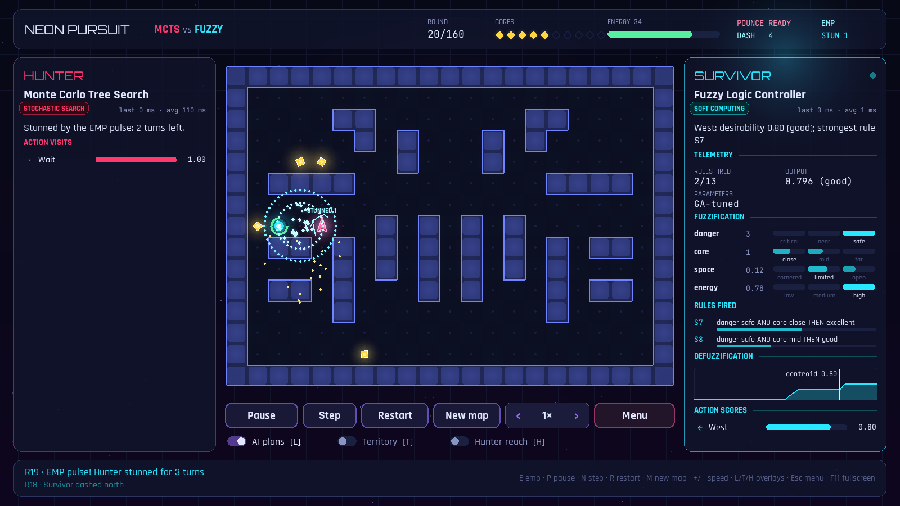
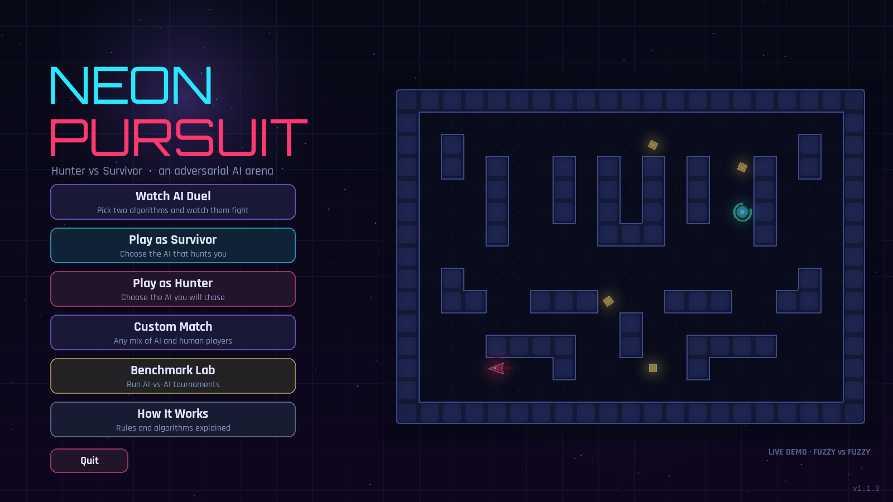
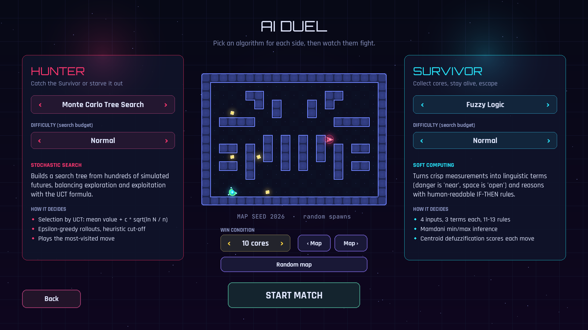
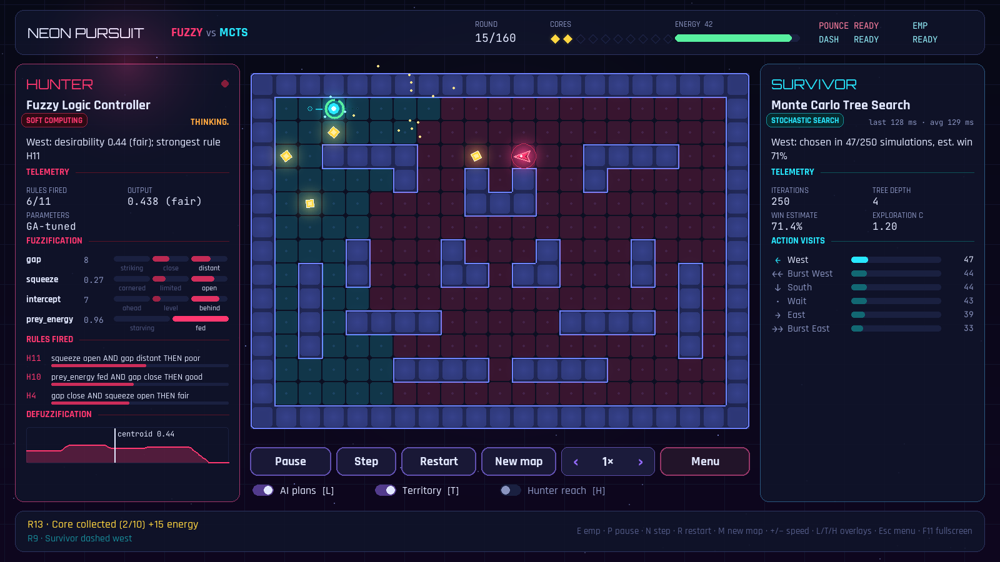
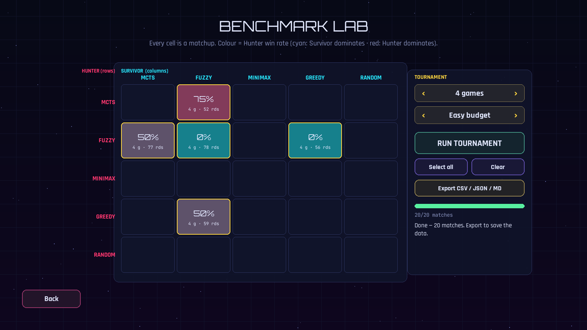

<div align="center">

# NEON PURSUIT

**Hunter vs Survivor: an adversarial AI arena where Monte Carlo Tree Search, Fuzzy Logic and Minimax fight it out, and you can watch them think.**

[](https://github.com/k-i-mahi/AI-Project/actions/workflows/ci.yml)


[](https://github.com/astral-sh/ruff)

[](LICENSE)



</div>

---

## Contents

- [About](#about)
- [Features](#features)
- [Quick start](#quick-start)
- [How to play](#how-to-play)
- [The AI](#the-ai)
- [Benchmark results](#benchmark-results)
- [Command line](#command-line)
- [Architecture](#architecture)
- [Development](#development)
- [Known limitations and roadmap](#known-limitations-and-roadmap)
- [License](#license)

## About

Neon Pursuit is a turn-based **pursuit–evasion game** built as an Artificial Intelligence
course project. Two agents share a procedurally generated neon arena:

- the **Hunter** 🔺 tries to catch the Survivor, or to cut it off from food until it starves;
- the **Survivor** 🔵 has to keep collecting energy cores to stay alive. It escapes with
  10 cores, using a wall-leaping **Blink Dash** and a Hunter-stunning **EMP Pulse** when
  things get tight.

Each side can be driven by a different AI technique: **Monte Carlo Tree Search**, a
**Mamdani Fuzzy Logic controller** (tuned by a **Genetic Algorithm**), **Minimax with α-β
pruning**, or Greedy and Random baselines. You can also take control of either side yourself.
Every decision is explained live on screen.

## Features

- 🧠 **Six AI techniques.** MCTS, Fuzzy Logic, Minimax α-β, Greedy and Random agents can each
  play *either* role, and a Genetic Algorithm optimises the fuzzy controllers.
- 🔍 **Explainable AI panels.** Live telemetry for every decision: per-action scores, MCTS visit
  counts, fuzzification bars, rule activations, the centroid plot and the predicted path.
- 🎮 **Pick your matchup.** *Watch AI Duel* lets you choose both algorithms and their difficulty.
  *Play as Survivor / Hunter* lets you choose your AI opponent.
- ⚡ **Survivor abilities.** Blink Dash leaps over a wall; EMP Pulse stuns a nearby Hunter
  for 3 turns.
- 🗺️ **Random but fair arenas.** Every game rolls a new seed: mirrored walls, guaranteed
  connectivity and random, well-separated spawns. Any match can be replayed from its seed.
- 🧪 **Benchmark Lab.** Run AI-vs-AI tournaments in parallel and get a win-rate heatmap, plus
  CSV / JSON / Markdown export with 95 % confidence intervals.
- ✨ **Polished visuals.** Glow and particle effects, motion trails, EMP shockwaves, screen
  shake, and territory / hunter-reach overlays. 60 FPS, scales to any window or full screen.
- ✅ **Engineered like production code.** Strict mypy, ruff, a pytest suite (including
  headless UI tests), pre-commit, and CI on Windows / macOS / Linux × Python 3.11–3.13.

<table>
<tr>
<td width="50%"></td>
<td width="50%"></td>
</tr>
<tr>
<td></td>
<td></td>
</tr>
</table>

## Quick start

Requires **Python 3.11+**.

```bash
git clone https://github.com/k-i-mahi/AI-Project.git
cd AI-Project
python -m venv .venv
# Windows: .venv\Scripts\activate    macOS/Linux: source .venv/bin/activate
pip install -e .
neon-pursuit            # or: python -m neon_pursuit
```

From the menu choose **Watch AI Duel** (pick any two algorithms and a difficulty for each),
**Play as Survivor** / **Play as Hunter** (pick the AI opponent), **Custom Match**,
**Benchmark Lab** or **How It Works**.

## How to play

| | Hunter 🔺 | Survivor 🔵 |
|---|---|---|
| **Goal** | Capture the Survivor, or starve it | Collect 10 cores, or last 160 rounds |
| **Burst move** | *Pounce*: 2 tiles, 9-round cooldown | *Blink Dash*: 2 tiles, **can leap a wall**, 7-round cooldown, 3 energy |
| **Special** | n/a | *EMP Pulse*: stuns a Hunter within 3 tiles for 3 turns (18-round cooldown, 4 energy) |
| **Pressure** | n/a | −1 energy per round; each core gives +15 |

The Survivor moves first, then the Hunter; together these make one round. New cores appear
on the Survivor's side of the map, so the Hunter has to hunt rather than camp. Full rules and
how the numbers were chosen: [docs/GAME_RULES.md](docs/GAME_RULES.md).

| Keys | Action |
|---|---|
| `WASD` / arrow keys | move one tile (when you control a side) |
| `Shift` + direction | Blink Dash / Pounce |
| `E` | EMP Pulse (Survivor) |
| `Space` | wait |
| Click a highlighted ring | move there |
| `P` · `N` | pause · step one move |
| `L` · `T` · `H` | toggle AI-plan · territory · hunter-reach overlays |
| `+` / `-` | simulation speed (0.5× – 8×) |
| `R` · `M` · `Esc` · `F11` | rematch · new map · menu · fullscreen |

## The AI

| Algorithm | Family | How it decides |
|---|---|---|
| **Monte Carlo Tree Search** | Stochastic search | UCT selection, ε-greedy rollouts with a heuristic cut-off, decisive / anti-decisive root screening |
| **Fuzzy Logic Controller** | Soft computing | 4 fuzzified inputs, 11–13 Mamdani rules, centroid defuzzification; ~1 ms per move, no search |
| **Minimax + α-β** | Adversarial search | Negamax, iterative deepening under a node budget, move ordering, transposition table |
| **Greedy** | Baseline | One-ply lookahead on precomputed BFS distances |
| **Random** | Baseline | Uniformly random legal moves |
| **Genetic Algorithm** | Evolutionary optimisation | Evolves the fuzzy membership functions and rule weights (`neon-pursuit tune`) |

Some details worth knowing:

- **Fuzzy partitions.** With Mamdani + centroid, a lone active output term always defuzzifies
  to its centre, which made the first controller blind to distance. Every input is now an
  overlapping partition whose memberships sum to 1 (a unit test checks this).
- **The GA found a loophole.** Its first run taught the Survivor to stop treating "capture next
  move" as critical. The fix was a hard domain constraint plus a regression test.
- **MCTS shallow traps.** Benchmarks exposed MCTS stepping into one-move captures; root
  screening for decisive / anti-decisive moves removed them.
- **Deterministic budgets.** Search stops after N iterations / nodes, never on a clock, so
  results don't depend on CPU load.

The full write-up, with formulas, rule bases and the GA design, is in
[docs/ALGORITHMS.md](docs/ALGORITHMS.md).

## Benchmark results

500 matches: 5 Hunter algorithms × 5 Survivor algorithms × 20 seeded maps (seeds 1000–1019), **Normal** difficulty (MCTS 250 iterations, Minimax 6 000 nodes), default rules, GA-tuned fuzzy controllers.
Hunter win rate (rows: Hunter, columns: Survivor):

| Hunter ↓ · Survivor → | MCTS | Fuzzy | Minimax | Greedy | Random |
|---|---:|---:|---:|---:|---:|
| **MCTS** | 35% | 15% | 30% | 30% | 100% |
| **Fuzzy** | 10% | 10% | 25% | 5% | 100% |
| **Minimax** | 85% | 40% | 90% | 40% | 100% |
| **Greedy** | 0% | 5% | 0% | 5% | 100% |
| **Random** | 0% | 0% | 0% | 0% | 100% |

| Algorithm | Win rate as Hunter | Win rate as Survivor | Overall | 95% CI (overall) |
|---|---:|---:|---:|---:|
| Minimax | 71% | 71% | **71%** | 64%–77% |
| MCTS | 42% | 74% | **58%** | 51%–65% |
| Fuzzy | 30% | 86% | **58%** | 51%–65% |
| Greedy | 22% | 84% | **53%** | 46%–60% |
| Random | 20% | 0% | **10%** | 7%–15% |

The Genetic Algorithm's effect, measured on held-out maps:

| Matchup (held-out seeds 20000–20019, Normal) | Hand-made fuzzy | GA-tuned fuzzy |
|---|---:|---:|
| Fuzzy **Hunter** vs MCTS: Hunter win rate ↑ | 0 % | **15 %** |
| Fuzzy **Hunter** vs Minimax: Hunter win rate ↑ | 0 % | **25 %** |
| Fuzzy **Hunter** vs Greedy: Hunter win rate ↑ | 0 % | 0 % |
| MCTS Hunter vs Fuzzy **Survivor**: Hunter win rate ↓ | 60 % | **25 %** |
| Minimax Hunter vs Fuzzy **Survivor**: Hunter win rate ↓ | 100 % | **60 %** |
| Greedy Hunter vs Fuzzy **Survivor**: Hunter win rate ↓ | 20 % | **15 %** |

**Takeaways:** Minimax is the strongest algorithm and the only reliable Hunter, but no longer
unbeatable. The GA-tuned Fuzzy controller became the best Survivor while thinking over 100× faster
than the search agents. Analysis, confidence intervals and every matchup are in
[docs/BENCHMARKS.md](docs/BENCHMARKS.md).

## Command line

```bash
neon-pursuit                                        # open the game
neon-pursuit play --hunter mcts --survivor human    # jump straight into a match
neon-pursuit play --hunter human --survivor fuzzy --difficulty hard --seed 7
neon-pursuit simulate --hunter mcts --survivor fuzzy --seed 42 --render   # terminal only
neon-pursuit benchmark --games 20 --difficulty normal --workers 6         # tournament + export
neon-pursuit benchmark --hunters fuzzy --fuzzy-profile manual             # compare hand-made fuzzy
neon-pursuit tune --role both --generations 12 --workers 6                # re-run the GA
```

Algorithms: `mcts`, `fuzzy`, `minimax`, `greedy`, `random` (plus `human` for `play`).
Difficulties: `easy`, `normal`, `hard`. Run `neon-pursuit <command> --help` for every option.

## Architecture

```
src/neon_pursuit/
├── engine/      pure, deterministic rules · map generation · abilities · board analysis (no pygame)
├── ai/          MCTS · minimax · fuzzy/ (inference, genomes, controllers, GA tuner) · baselines
├── benchmark/   parallel tournaments · CSV/JSON/Markdown reports · Wilson intervals
├── game/        pygame-ce UI · scenes · renderer · brain panels · AI worker process
├── presets.py   Easy / Normal / Hard search budgets
└── cli.py       `neon-pursuit` entry point (play · simulate · benchmark · tune)
```

The engine and AI never import pygame, so they are unit-tested, benchmarked headlessly and run
in a separate worker process. The UI stays at 60 FPS while an agent thinks. Diagrams and
design decisions: [docs/ARCHITECTURE.md](docs/ARCHITECTURE.md).

## Development

```bash
pip install -e ".[dev]"
pre-commit install

pytest --cov                            # tests + coverage (UI tests run headlessly)
ruff check src tests scripts            # lint
ruff format src tests scripts           # format
mypy                                    # strict type checking
python scripts/capture_screenshots.py   # re-render docs/images headlessly
```

See [CONTRIBUTING.md](CONTRIBUTING.md) for guidelines, including how to add a new algorithm.

## Known limitations and roadmap

Limitations, stated plainly:

- **Survivor-leaning balance.** Removing the core-camping exploit tilted the game toward the
  Survivor: only Minimax hunts reliably (71 % as Hunter); MCTS wins 42 % and Fuzzy 30 %.
  `cores_to_win` is the knob for a closer fight.
- **Greedy vs Greedy is one-sided.** A one-ply chaser cannot corner anyone, so the Survivor
  wins that mirror almost every time.
- The GA tunes against a fixed opponent panel at Easy budgets, so a tuned controller can still
  be exploited by opponents it never trained against.

Roadmap:

- [ ] Partial observability (fog of war) with belief-state agents
- [ ] Reinforcement-learning agent (Q-learning / DQN) trained against the existing ones
- [ ] Co-evolution: tune Hunter and Survivor genomes against each other
- [ ] Replay files and a timeline scrubber
- [ ] Sound design and a packaged Windows executable

## License

Released under the [MIT License](LICENSE).
Bundled fonts are licensed under the SIL Open Font License
([Orbitron](src/neon_pursuit/assets/fonts/OFL-Orbitron.txt),
[Rajdhani](src/neon_pursuit/assets/fonts/OFL-Rajdhani.txt),
[JetBrains Mono](src/neon_pursuit/assets/fonts/OFL-JetBrainsMono.txt)).
