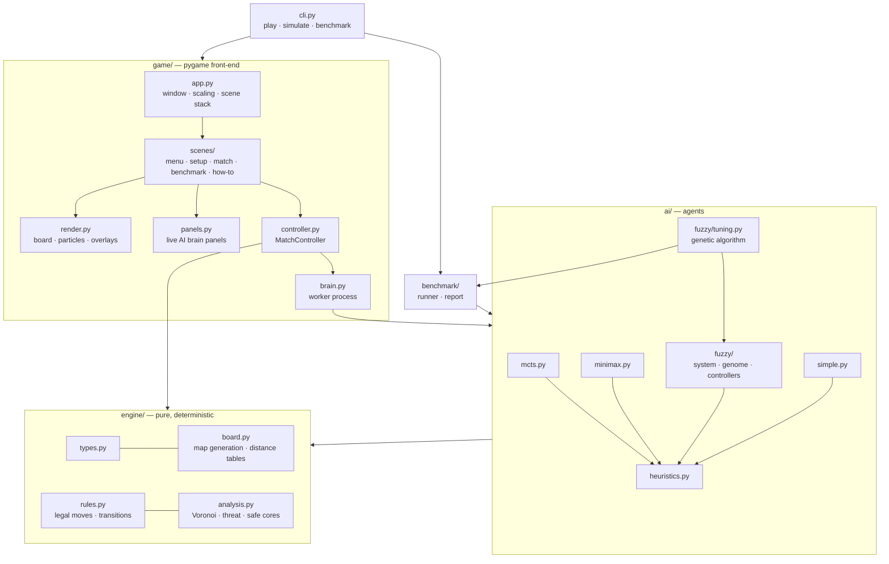

# Architecture

Neon Pursuit is split into layers with one-way dependencies. The engine and AI are pure Python
with **no pygame import**, so they can be unit-tested, benchmarked headlessly and run inside
worker processes.



## Layers

| Package | Responsibility | Depends on |
|---|---|---|
| `engine` | Immutable `GameState`, `MatchConfig`, seeded map generation, rules, board analysis | stdlib only |
| `ai` | `Agent` interface, MCTS, Minimax, Fuzzy (engine, genomes, controllers), baselines, registry, GA tuner | `engine` (the tuner also uses `benchmark`) |
| `benchmark` | Headless matches, parallel tournaments (`ProcessPoolExecutor`), CSV/JSON/MD export | `engine`, `ai` |
| `game` | Rendering, input, scenes, background AI execution | everything above + pygame-ce |
| `cli` | `argparse` entry point (`neon-pursuit`) | everything above; pygame is imported lazily |

## Key design decisions

**Immutable, deterministic engine.** `GameState` is a frozen dataclass. `apply_action` returns
a new state and can emit `GameEvent`s for the UI. There is no hidden randomness: core respawns
come from a precomputed, seeded sequence. That keeps MCTS and Minimax trees exact and makes
every match reproducible from its seed.

**Deterministic search budgets.** MCTS stops after N iterations and Minimax after N nodes,
never on wall-clock time. With a time budget, an agent's strength depended on how busy the CPU
was, so benchmark results drifted between runs. Wall-clock limits remain only as safety nets.

**Bounded parallelism.** Tournaments, the Benchmark Lab and the GA run matches in worker
processes, `min(8, CPUs − 1)` by default (`benchmark.runner.default_workers`). An earlier
unbounded default ran a 16 GB machine out of memory during long tuning runs.

**Precomputed path tables.** The arena has 315 cells. An all-pairs BFS distance table
(~100 k entries) is built once per map and cached with `functools.lru_cache`. Distance, threat,
Voronoi territory and safe-core queries are all table lookups, which matters in pure Python,
where MCTS evaluates thousands of positions per move.

**AI off the render thread.** Search agents are CPU-bound, and Python's GIL would stall a
thread-based approach. `game/brain.py` runs agents in a **single spawned worker process** and
returns `concurrent.futures.Future`s. Agents are stateful (each owns a seeded RNG), so they live
in the worker, keyed by `(match_id, role)`. The UI keeps rendering at 60 FPS while the next move
is computed, and the next decision starts during the current move's animation.

**Explainability as a first-class output.** Agents return an `Insight` alongside each action.
The UI never reaches into agent internals; it only renders insights. New algorithms get brain
panels for free by filling the same structure.

**Resolution-independent UI.** Scenes lay out on a fixed 1600 × 900 canvas. `App` letterboxes
and scales it to any window size (or full screen with F11) and maps mouse coordinates back.

## Adding a new algorithm

1. Subclass `neon_pursuit.ai.base.Agent` and implement `choose(state) -> (Action, Insight)`.
2. Add an `AlgorithmId` member and an `AlgorithmInfo` entry in `ai/registry.py`, and extend
   `create_agent`.
3. Add it to `CONTROLLERS` in `game/scenes/setup.py`.
4. The legality, determinism and immediate-capture tests in `tests/test_agents.py` are
   parametrised over `AlgorithmId`, so the new agent is covered automatically.

## Repository layout

```
.
├── src/neon_pursuit/
│   ├── engine/          # rules, map generation, analysis (pure)
│   ├── ai/              # MCTS, minimax, fuzzy/ (system, genome, controllers, tuning, tuned.json),
│   │                    # baselines, heuristics, registry
│   ├── benchmark/       # tournaments + report export
│   ├── game/            # pygame UI: app, scenes/, render, panels, widgets, theme, brain
│   ├── assets/fonts/    # Orbitron, Rajdhani, JetBrains Mono (SIL OFL)
│   ├── presets.py       # Easy / Normal / Hard search budgets
│   └── cli.py           # `neon-pursuit` entry point
├── tests/               # pytest suite
├── scripts/             # headless screenshot capture
├── docs/                # rules, algorithms, architecture, benchmarks, images
└── .github/             # CI, release, templates, dependabot
```
